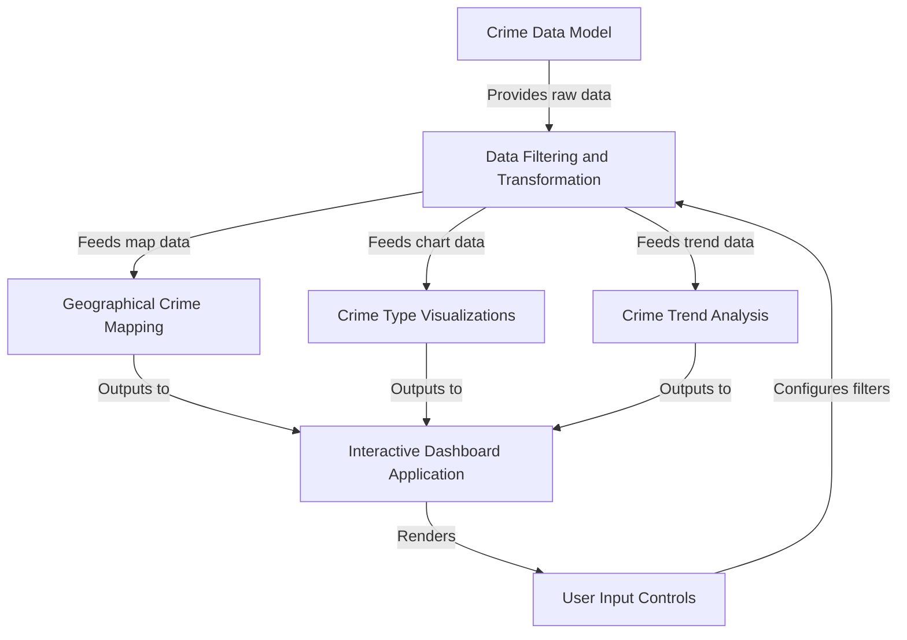
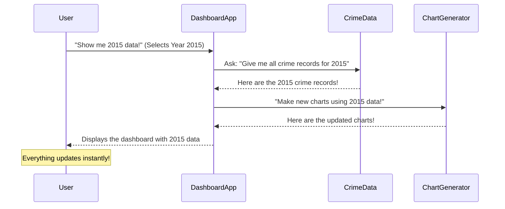
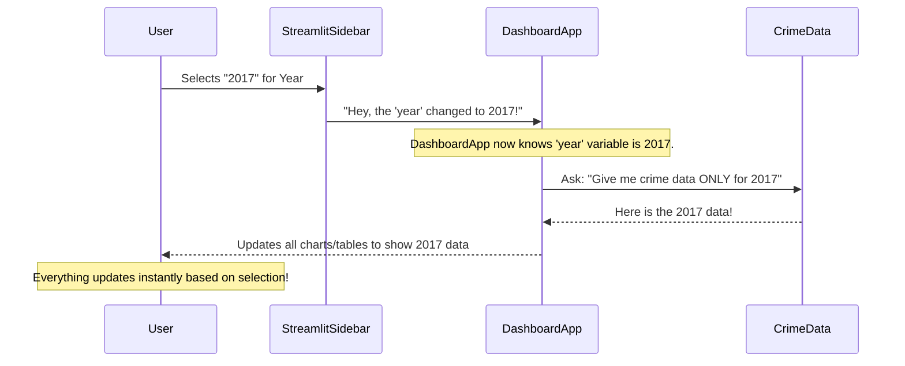
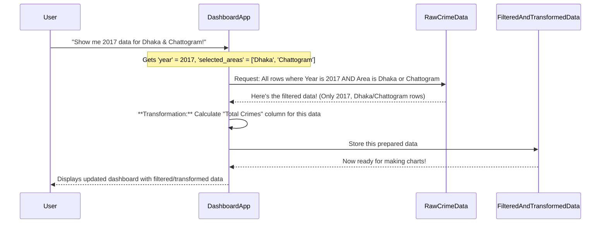
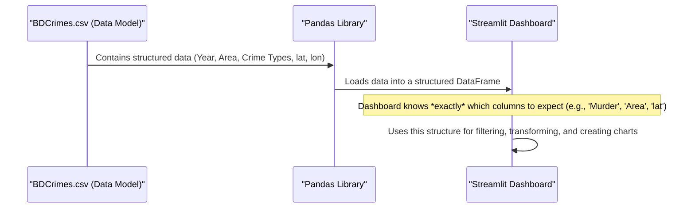
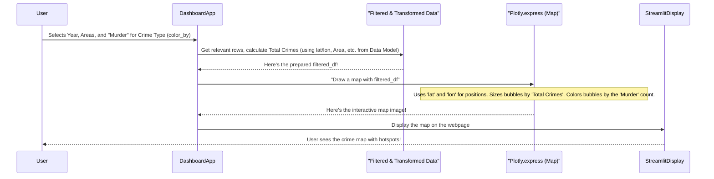
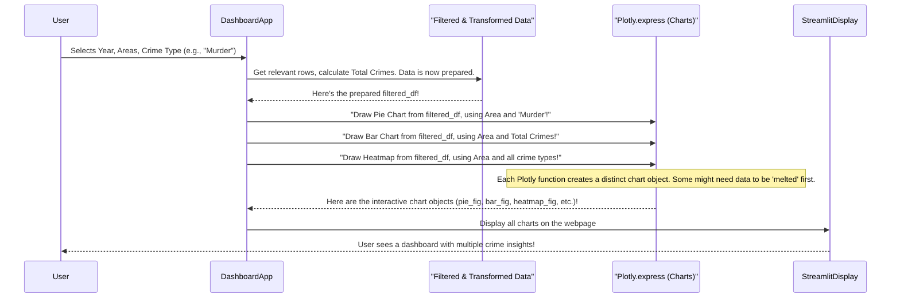
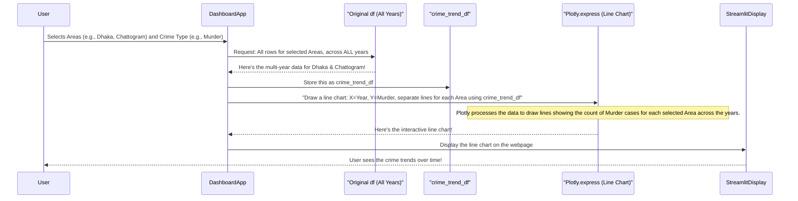

# Bangladesh-Crime-Statistics-Project


# Tutorial: Bangladesh-Crime-Statistics-Project

This project is an *interactive dashboard* built with Streamlit that helps users **explore crime statistics** in Bangladesh from 2010 to 2019. It allows you to select specific years and areas to visualize crime data on a *geographical map*, break down crime types using various charts, and analyze *crime trends* over time.


## Visual Overview



## Chapters

1. [Interactive Dashboard Application
](01_interactive_dashboard_application_.md)
2. [User Input Controls
](02_user_input_controls_.md)
3. [Data Filtering and Transformation
](03_data_filtering_and_transformation_.md)
4. [Crime Data Model
](04_crime_data_model_.md)
5. [Geographical Crime Mapping
](05_geographical_crime_mapping_.md)
6. [Crime Type Visualizations
](06_crime_type_visualizations_.md)
7. [Crime Trend Analysis
](07_crime_trend_analysis_.md)

---

# Chapter 1: Interactive Dashboard Application

Welcome to the Bangladesh Crime Statistics Project! In this tutorial, we'll learn how to understand and build a powerful tool to explore crime data: an "Interactive Dashboard Application."

### What Problem Are We Trying to Solve?

Imagine you have a giant collection of crime reports, perhaps thousands of pages, detailing crimes in different areas of Bangladesh for many years. If someone asks you: "What was the total number of 'Murder' cases in Dhaka in 2017?" or "How did 'Robbery' cases change over the years across all areas?", finding these answers would be incredibly hard and time-consuming if you had to flip through all those papers manually!

This is where an **Interactive Dashboard** comes to the rescue! It's like having a magic window into your data that answers your questions instantly.

### What is an Interactive Dashboard?

Think of an Interactive Dashboard as a **dynamic control panel** for exploring data. Instead of static charts or tables that don't change, a dashboard lets *you* actively choose what you want to see.

For our project, this means:
*   You can select a specific **year** (e.g., 2015).
*   You can choose particular **areas** (e.g., Dhaka, Chattogram).
*   You can pick a **crime type** (e.g., Murder, Theft).

And when you make these choices, all the charts, maps, and tables on the screen instantly update to show you *exactly* the information you asked for!

**It's like having a specialized TV remote control for crime statistics.** You press a button (select a year), and the "channel" (the data shown) changes instantly to reflect your choice.

### How Do You Use Our Dashboard?

Our `Bangladesh-Crime-Statistics-Project` features a dashboard built using a friendly Python library called **Streamlit**. When you run our project's main file (`BDCrimeProject.py`), you'll see a web application appear in your browser.

On the left side of the dashboard, you'll find the "TV remote" controls:

*   **Select Year**: A dropdown menu to pick a specific year (e.g., 2010 to 2019).
*   **Select Area(s)**: A list where you can check one or more areas.
*   **Crime Type**: Another dropdown to choose which type of crime (like "Dacoity" or "Murder") you want to focus on.

As you change these selections, you'll see the charts, maps, and tables on the right side of the dashboard update immediately.

Here's a tiny peek at how these "remote controls" are created in our code. Don't worry about understanding every line just yet; we'll break them down in detail in the [User Input Controls](02_user_input_controls_.md) chapter!

```python
import streamlit as st # This line brings in the Streamlit library

# Imagine 'df' is our big table of crime data
# df = pd.read_csv("BDCrimes.csv")

# Create a dropdown menu for years on the sidebar
year = st.sidebar.selectbox("Select Year", sorted(df["Year"].unique()))

# Create a multi-select box for areas on the sidebar
selected_areas = st.sidebar.multiselect("Select Area(s)", df["Area"].unique())
```

In the code above:
*   `import streamlit as st` is how we tell Python we want to use Streamlit.
*   `st.sidebar.selectbox` creates a dropdown menu on the left side (the "sidebar"). The first text is what the user sees, and the second part tells it what options to show (like `2010`, `2011`, etc., from our data).
*   `st.sidebar.multiselect` is similar but lets you pick more than one option at once.

When a user interacts with these controls, Streamlit automatically re-runs parts of our code to update the dashboard!

### How Does it Work Under the Hood?

Let's simplify how an interactive dashboard processes your choices. Imagine you're the "User" and the dashboard is a helpful assistant.



1.  **User Input**: You, the "User," interact with the controls on the dashboard (e.g., selecting "2015" from the year dropdown).
2.  **Dashboard Reacts**: The `DashboardApp` (our Streamlit application) detects your change.
3.  **Data Filtering**: The app then goes to the `CrimeData` (our raw crime data) and asks for *only* the information that matches your selection (e.g., only crime records from 2015).
4.  **Chart Generation**: With the freshly filtered data, the `DashboardApp` then tells the `ChartGenerator` to create new charts and maps based *only* on this specific data.
5.  **Display Update**: Finally, the `DashboardApp` takes these new charts and displays them for you to see. This whole process happens incredibly fast, making it feel "interactive."

Let's look at some very simplified pieces of code from `BDCrimeProject.py` that represent these steps:

First, we need to load our raw crime data, which usually comes from a file like `BDCrimes.csv`.

```python
import pandas as pd # This library helps us work with data tables

# Load our crime data from the 'BDCrimes.csv' file
df = pd.read_csv("BDCrimes.csv")
# 'df' now holds all our crime data in a table format!
```
*   `pandas` is a powerful Python library that helps us organize and work with data, much like spreadsheets. We call it `pd` for short.
*   `pd.read_csv("BDCrimes.csv")` reads all the information from our `BDCrimes.csv` file and puts it into something called a `DataFrame`, which is like a table, and we store it in a variable named `df`.

Next, once we have the user's choices (like `year` or `selected_areas`), we use them to filter our data.

```python
# 'year' and 'selected_areas' come from the user's choices on the sidebar
# filtered_df = df[(df["Year"] == year) & (df["Area"].isin(selected_areas))]

# Simplified example: Filter the big 'df' table to only show data for the chosen 'year'
filtered_df = df[df["Year"] == year]
# Now 'filtered_df' is a smaller table, only containing crimes from the selected year!
```
*   This line `filtered_df = df[df["Year"] == year]` is very important. It takes our full `df` (all data) and creates a *new*, smaller table called `filtered_df` that only includes rows where the "Year" column matches the `year` the user selected. This is the core of how the dashboard becomes "interactive." We'll dive deeper into this in [Data Filtering and Transformation](03_data_filtering_and_transformation_.md).

Finally, we use the `filtered_df` to create and display our charts:

```python
import plotly.express as px # This library helps us make beautiful charts

# Imagine 'filtered_df' has data only for the selected year and area
# Create a simple bar chart showing 'Total Crimes' for each 'Area'
fig = px.bar(
    filtered_df,
    x="Area",
    y="Total Crimes",
    title=f"Total Crimes by Area in {year}"
)

# Display this chart in our Streamlit application
st.plotly_chart(fig)
```
*   `plotly.express` (or `px` for short) is another Python library that makes creating interactive charts super easy.
*   `px.bar(...)` creates a bar chart using our `filtered_df`. We tell it which columns to use for the X-axis (`"Area"`) and Y-axis (`"Total Crimes"`).
*   `st.plotly_chart(fig)` is how Streamlit takes the chart we just made and displays it beautifully in our web application.

### Conclusion

In this chapter, you've learned that an **Interactive Dashboard Application** is a dynamic tool that makes exploring large datasets, like our crime statistics, easy and intuitive. It's like a special remote control for your data, allowing you to instantly see different "views" based on your selections. We briefly touched upon how it works by taking user input, filtering data, and then updating charts.

Next, we'll dive deeper into those "TV remote" controls and understand how they allow users to make their selections. Get ready to learn about how to implement these useful controls in Python!

[Next Chapter: User Input Controls](02_user_input_controls_.md)

---


# Chapter 2: User Input Controls

Welcome back! In [Chapter 1: Interactive Dashboard Application](01_interactive_dashboard_application_.md), we learned that our `Bangladesh-Crime-Statistics-Project` dashboard is like a "magic window" into crime data, giving you a dynamic "TV remote" to explore. Now, let's zoom in on that "remote control" itself!

### Why Are These Controls Important?

Imagine you have a huge stack of crime reports. If you want to find out: "How many 'Robbery' cases were there in 'Dhaka' and 'Chattogram' districts specifically in the year '2017'?", you'd have to manually sort through hundreds or thousands of pages. That sounds exhausting, right?

**User Input Controls** are the interactive buttons, menus, and checkboxes on our dashboard that solve this problem! They are the parts that let *you* tell the dashboard exactly what data you want to see. They act like filters on a coffee machine – you select the year, specific areas, and the type of crime you're most interested in, and the dashboard brews up the exact data visualizations you asked for, instantly!

Without these controls, our dashboard would just show *all* the data at once, which would be overwhelming and not very useful. They give you the power to ask specific questions and get immediate answers.

### Getting to Know the "Remote Control" Elements

In our `Bangladesh-Crime-Statistics-Project`, you'll find these interactive elements mostly on the **sidebar**, which is the panel on the left side of your screen when you run the dashboard.

We primarily use two types of controls from the `streamlit` library:

1.  **`st.sidebar.selectbox` (Dropdown Menu)**:
    *   Think of this as a regular dropdown list where you can choose **one option** from a list.
    *   We use it for selecting a specific **Year** or a single **Crime Type**.

2.  **`st.sidebar.multiselect` (Multi-selection Box)**:
    *   This is like a list where you can **check multiple options** at once.
    *   We use it for selecting multiple **Areas** (districts) at the same time.

Let's see how we create these in our Python code, piece by piece. Remember, these lines come from our `BDCrimeProject.py` file.

First, we need to load the `streamlit` library and our crime data:

```python
import streamlit as st # This line brings in the Streamlit library
import pandas as pd    # This library helps us work with data tables

# Load our crime data from the 'BDCrimes.csv' file
df = pd.read_csv("BDCrimes.csv")
# 'df' now holds all our crime data in a table format!
```
*   We `import streamlit as st` to use Streamlit's features.
*   We load our data into `df`, which is like a big spreadsheet containing all our crime statistics.

Now, let's add the controls to our "sidebar":

#### 1. The "Year" Selector (`st.sidebar.selectbox`)

```python
# Create a dropdown menu for years on the sidebar
# It will show 'Select Year' as the label.
# The options will be all the unique years found in our 'df' data, sorted from smallest to largest.
year = st.sidebar.selectbox("Select Year", sorted(df["Year"].unique()))
```
*   `st.sidebar.selectbox(...)`: This tells Streamlit to create a dropdown menu *on the sidebar*.
*   `"Select Year"`: This is the text label that appears next to the dropdown, telling the user what it's for.
*   `sorted(df["Year"].unique())`: This is super useful!
    *   `df["Year"]`: Looks at the "Year" column in our `df` (data table).
    *   `.unique()`: Finds all the *different* (unique) years available in that column (e.g., 2010, 2011, ..., 2019).
    *   `sorted(...)`: Arranges those years in order (e.g., 2010, 2011, 2012...).
*   `year = ...`: When you select a year (e.g., 2017) from this dropdown, that value (2017) is stored in a Python variable named `year`. We will use this `year` variable later to filter our data!

#### 2. The "Area(s)" Selector (`st.sidebar.multiselect`)

```python
# Create a multi-select box for areas on the sidebar
# It will show 'Select Area(s)' as the label.
# The options will be all the unique areas found in our 'df' data.
# 'default=df["Area"].unique()' means all areas will be pre-selected when the dashboard first loads.
selected_areas = st.sidebar.multiselect("Select Area(s)", df["Area"].unique(), default=df["Area"].unique())
```
*   `st.sidebar.multiselect(...)`: This tells Streamlit to create a multi-selection box *on the sidebar*.
*   `"Select Area(s)"`: The label for this control.
*   `df["Area"].unique()`: Gets all the unique area names from our data (e.g., Dhaka, Chattogram, Khulna, etc.). These are the options you can choose from.
*   `default=df["Area"].unique()`: This is a nice touch! It means that when you first open the dashboard, *all* the areas will be pre-selected. You can then uncheck the ones you don't want.
*   `selected_areas = ...`: When you check or uncheck areas, a Python list of the *currently selected* area names is stored in the `selected_areas` variable (e.g., `['Dhaka', 'Chattogram']`). This list is crucial for filtering the data.

#### 3. The "Crime Type" Selector (`st.sidebar.selectbox`)

```python
# Create another dropdown menu for selecting a crime type to highlight
# It will show 'Crime Type' as the label.
# The options are a pre-defined list of crime types.
color_by = st.sidebar.selectbox("Crime Type", [
    "Dacoity", "Robbery", "Murder", "Speedy Trial", "Riot",
    "Women & Child Repression", "Kidnapping", "Police Assault",
    "Burglary", "Theft", "Other Cases"
])
```
*   This is another `st.sidebar.selectbox`, similar to the year selector.
*   `"Crime Type"`: The label for this dropdown.
*   `[...]`: Here, we provide a direct list of all the crime types we want the user to be able to select.
*   `color_by = ...`: The specific crime type chosen by the user (e.g., "Murder") is stored in the `color_by` variable. This is then used to decide which crime type's data to highlight in certain charts and maps.

### How Do These Controls Work "Under the Hood"?

Let's revisit our "TV remote" analogy from Chapter 1. When you press a button or change a setting on your TV remote, something instantly changes on the TV screen. Our dashboard works the same way:



1.  **You Interact**: As the `User`, you click on a dropdown or check a box in the `StreamlitSidebar`.
2.  **Streamlit Detects Change**: `Streamlit` (the library our `DashboardApp` is built with) immediately notices that you've changed a control.
3.  **Value Update**: Streamlit takes your selection (e.g., "2017", or `['Dhaka', 'Chattogram']`) and stores it in the Python variable that corresponds to that control (like `year` or `selected_areas`).
4.  **Dashboard App Reacts**: Because one of these variables has changed, Streamlit automatically tells the entire `DashboardApp` code to re-run from the beginning. This is how Streamlit makes dashboards interactive!
5.  **Data Filtering (Next Chapter!)**: When the `DashboardApp` re-runs, it uses the *new* values in `year`, `selected_areas`, and `color_by` to filter the `CrimeData`. This means it selects only the rows from our big `df` table that match your chosen criteria. We'll explore this crucial step in detail in [Chapter 3: Data Filtering and Transformation](03_data_filtering_and_transformation_.md).
6.  **Charts Update**: Finally, with the newly filtered data, all the charts, maps, and tables on your screen are redrawn to reflect your selections.

### Conclusion

You've now learned about the interactive heart of our dashboard: **User Input Controls**. These `st.sidebar.selectbox` and `st.sidebar.multiselect` elements allow you to become the director of your data exploration, letting you filter and focus on exactly what you need. You've seen how they appear in the code and how your choices are captured into Python variables.

The next exciting step is to understand what happens *after* you make a selection. How does the dashboard actually *use* those `year` and `selected_areas` variables to narrow down the vast amount of crime data? Let's find out in the next chapter!

[Next Chapter: Data Filtering and Transformation](03_data_filtering_and_transformation_.md)

---


# Chapter 3: Data Filtering and Transformation

Welcome back! In [Chapter 1: Interactive Dashboard Application](01_interactive_dashboard_application_.md), we got a high-level view of our dashboard, and in [Chapter 2: User Input Controls](02_user_input_controls_.md), we learned how your selections (like choosing a year or area) are captured into Python variables (`year`, `selected_areas`, `color_by`).

Now, what happens *after* you make those selections? How does the dashboard take your choice of "2017" and "Dhaka" and turn it into *just* the crime data for Dhaka in 2017, out of thousands of records? This is where **Data Filtering and Transformation** comes in!

### Why Do We Filter and Transform Data?

Imagine you're a chef preparing a special meal. You have a huge pantry (our raw crime data, `df`) filled with all sorts of ingredients. The recipe (your selection on the dashboard) calls for *only* specific ingredients, say, "fresh vegetables for a salad" and "chicken for the main dish." You wouldn't throw *everything* from the pantry into your cooking, right?

The problem **Data Filtering and Transformation** solves is similar:

*   **Filtering:** We need to pick **only the relevant "ingredients" (data rows)** from our giant "pantry" of raw crime data. For example, if you select "2017" and "Dhaka", we only want to see crime records that happened in 2017 *and* in Dhaka. Without filtering, our maps and charts would try to show *all* years and *all* areas at once, making them messy and useless!
*   **Transformation:** Sometimes, the raw data doesn't have exactly what we need. Like if your recipe calls for "chopped onions," but you only have whole onions. You need to *transform* them. In our project, we need a "Total Crimes" column, but our raw data has separate columns for each crime type (Dacoity, Murder, Theft, etc.). We need to *transform* these individual crime counts into one single "Total Crimes" number per area per year.

It's like meticulously sorting and chopping your ingredients (filtering) and then combining them in new ways (transformation) to prepare them for cooking (the visualizations).

### How Do We Filter Data?

Filtering data means creating a smaller table (a `DataFrame` in `pandas`) that contains *only* the rows that meet certain conditions. In Python, using the `pandas` library, it's surprisingly simple!

Let's say `df` is our big table of crime data.

To filter for a specific year (e.g., 2017), we use a condition:

```python
import pandas as pd

# Imagine 'df' is our full crime data table
# df = pd.read_csv("BDCrimes.csv") # This loads all data

# Example: Filter for only the year 2017
crimes_2017 = df[df["Year"] == 2017]

# 'crimes_2017' now contains ONLY rows where the 'Year' column is 2017
# All other years are left out.
```
*   `df["Year"] == 2017`: This part creates a list of `True` and `False` values. It's `True` for every row where the "Year" is 2017 and `False` otherwise.
*   `df[...]`: When you put this `True`/`False` list inside the square brackets after `df`, `pandas` acts like a "sieve" and only lets through the rows where the condition was `True`.

What if we want to filter by **both** year *and* area? Let's say we want data for 2017 *and* for areas "Dhaka" or "Chattogram".

```python
# Assume 'year' is 2017 and 'selected_areas' is ['Dhaka', 'Chattogram']
# (These come from your sidebar selections in Chapter 2)

# Condition 1: Check if the year matches the selected year
is_correct_year = (df["Year"] == year)

# Condition 2: Check if the area is in our list of selected areas
is_selected_area = (df["Area"].isin(selected_areas))

# Combine both conditions using '&' (which means "AND")
# Only rows where BOTH conditions are True will be kept
filtered_df = df[is_correct_year & is_selected_area]

# 'filtered_df' now holds only the rows for the selected year and areas!
```
*   `df["Area"].isin(selected_areas)`: This is super handy! It checks if the "Area" value in a row is *one of* the values in our `selected_areas` list (e.g., is it 'Dhaka' OR 'Chattogram'?).
*   `&`: This symbol means "AND". So, `condition1 & condition2` means both `condition1` must be `True` AND `condition2` must be `True` for a row to be included.

### How Do We Transform Data (Creating "Total Crimes")?

Transformation is about creating new data from existing data. In our project, we need a "Total Crimes" column. Our original data has separate columns for each crime type (e.g., "Dacoity", "Murder", "Theft").

Imagine our `filtered_df` (after filtering) looks like this for Dhaka in 2017:

| Area  | Year | Dacoity | Robbery | Murder | ... |
| :---- | :--- | :------ | :------ | :----- | :-- |
| Dhaka | 2017 | 10      | 5       | 20     | ... |

We want to add a column named "Total Crimes" that sums up all the crime type columns for each row.

```python
# Imagine 'filtered_df' is the table we filtered in the previous step.

# List all the columns that represent different crime types
crime_columns = [
    "Dacoity", "Robbery", "Murder", "Speedy Trial", "Riot",
    "Women & Child Repression", "Kidnapping", "Police Assault",
    "Burglary", "Theft", "Other Cases"
]

# Create a new column 'Total Crimes'
# We sum the values across all 'crime_columns' for each row (axis=1 means sum rows)
filtered_df["Total Crimes"] = filtered_df[crime_columns].sum(axis=1)

# Now 'filtered_df' has a new column:
# | Area | Year | Dacoity | ... | Total Crimes |
# | :--- | :--- | :------ | :-- | :----------- |
# | Dhaka | 2017 | 10      | ... | 35           | (10+5+20 = 35, assuming only 3 crimes for simplicity)
```
*   `filtered_df[crime_columns]`: This selects *only* the crime type columns from our `filtered_df`.
*   `.sum(axis=1)`: This is the magic!
    *   `sum()` calculates the total.
    *   `axis=1` tells `pandas` to sum *horizontally* across the columns for each row. (If `axis=0`, it would sum vertically down each column).
*   `filtered_df["Total Crimes"] = ...`: This assigns the calculated sum to a *new* column named "Total Crimes" in our `filtered_df` table.

### How It Works Under the Hood

Let's visualize how the dashboard combines your choices with the data.

Think of it like a meticulous chef (the **DashboardApp**) receiving a specific order (your selections) and then going to the pantry (the **RawCrimeData**) to gather and prepare ingredients (filter and transform).



In the `BDCrimeProject.py` file, these steps happen right after your selections are captured:

```python
# --- Code from BDCrimeProject.py ---

# 1. User Input Controls (from Chapter 2, these variables are now set)
# year = st.sidebar.selectbox(...)
# selected_areas = st.sidebar.multiselect(...)

# 2. Data Filtering (Combines year and area selections)
filtered_df = df[(df["Year"] == year) & (df["Area"].isin(selected_areas))]
# 'filtered_df' is now a smaller table, only containing the data you asked for!

# 3. Data Transformation (Adding 'Total Crimes' column)
filtered_df["Total Crimes"] = filtered_df[[
    "Dacoity", "Robbery", "Murder", "Speedy Trial", "Riot",
    "Women & Child Repression", "Kidnapping", "Police Assault",
    "Burglary", "Theft", "Other Cases"
]].sum(axis=1)
# Now 'filtered_df' also has the 'Total Crimes' column ready for use!

# --- The rest of the code then uses 'filtered_df' to create charts ---
```
*   The first line `filtered_df = ...` is the **filtering** step, using the `year` and `selected_areas` variables directly from your choices.
*   The second code block, `filtered_df["Total Crimes"] = ...`, is the **transformation** step, calculating the `Total Crimes` column on this *already filtered* data.

After these two crucial steps, our `filtered_df` table is perfectly prepared. It's a clean, relevant, and enriched dataset, ready to be fed into all the different visualization functions to create charts and maps for the dashboard!

### Conclusion

You've now uncovered the core process of **Data Filtering and Transformation**! You've learned how your dashboard takes your selections, uses them to filter a large dataset down to only the relevant rows, and then transforms that data by adding useful new columns like "Total Crimes." This prepared data is the fuel for all the engaging visualizations you see on the dashboard.

Next up, we'll take a closer look at the structure of our raw crime data and how it's organized, which is essential for effective filtering and transformation.

[Next Chapter: Crime Data Model](04_crime_data_model_.md)

---


# Chapter 4: Crime Data Model

Welcome back! In our previous chapters, we learned about the dashboard's "TV remote" controls ([Chapter 2: User Input Controls](02_user_input_controls_.md)) and how your selections trigger the dashboard to **filter and transform** data ([Chapter 3: Data Filtering and Transformation](03_data_filtering_and_transformation_.md)). But for all of that to work smoothly, there's a super important foundation: how our crime data is organized in the first place! This is where the **Crime Data Model** comes in.

### What Problem Does a Crime Data Model Solve?

Imagine you have a huge pile of individual crime reports – some handwritten, some typed, some from different years, all with different ways of describing things. One report might say "Killing," another "Homicide," and yet another "Murder." One might use "Dhaka City" and another "Dha." If you wanted to find *all* murder cases in "Dhaka" over several years, it would be a messy, confusing nightmare!

The **Crime Data Model** is our project's solution to this chaos. Think of it as the **blueprint** or the **master plan** for how all our crime information is organized. It's like deciding that *every* book in a library will have a title, an author, and a specific shelf number. This way, no matter how many books you have, you can always find what you're looking for easily.

For our project, the model ensures that:
*   "Murder" always means the same thing and is always found in the "Murder" column.
*   "Dhaka" is consistently spelled as "Dhaka Metropolitan" or "Dhaka Division."
*   Every crime record has a "Year," an "Area," and all the crime type counts.

This consistent structure is what allows our dashboard to filter, sum, and map the data reliably!

### Understanding Our Crime Data Model: The `BDCrimes.csv` Spreadsheet

Our Crime Data Model is essentially defined by the columns (categories) in our `BDCrimes.csv` file. This file acts like a neatly organized spreadsheet where each row is a complete record of crime statistics for a specific year and area.

Let's look at the key parts of our data model, represented by the columns in `BDCrimes.csv`:

| Category Name        | What it Represents                                     | Example Values      |
| :------------------- | :----------------------------------------------------- | :------------------ |
| `Year`               | The specific year the crime data belongs to.           | `2010`, `2017`, `2019` |
| `Area`               | The geographical region (city or division).            | `Dhaka Metropolitan`, `Chattogram Division` |
| `lat`                | The latitude coordinate for the `Area`. (For mapping)  | `23.7115253`        |
| `lon`                | The longitude coordinate for the `Area`. (For mapping) | `90.4111451`        |
| `Dacoity`            | Number of Dacoity cases.                               | `47`, `1`, `0`      |
| `Robbery`            | Number of Robbery cases.                               | `220`, `3`, `10`    |
| `Murder`             | Number of Murder cases.                                | `245`, `9`, `19`    |
| `Theft`              | Number of Theft cases.                                 | `1915`, `4`, `127`  |
| `Narcotics Recoveries`| Number of Narcotics Recoveries.                       | `10535`, `272`, `1370` |
| ... (Other Crime Types) | Many other columns representing specific crime types. | (Various Numbers)   |

This table shows us the "blueprint" of our data. When we say "Crime Data Model," we're talking about this precise layout: having a `Year` column, an `Area` column, specific columns for `Murder`, `Theft`, etc., and also `lat`/`lon` for mapping.

### How Does Our Project Use This Model?

Our project relies on this consistent structure every step of the way.

1.  **Loading the Data**: The very first thing our `BDCrimeProject.py` file does is load this `BDCrimes.csv` file using the `pandas` library. `pandas` reads the file and understands its column structure, creating a "DataFrame" (which is like a table in Python).

    ```python
    import pandas as pd # Brings in the pandas library

    # Load our crime data from the 'BDCrimes.csv' file
    df = pd.read_csv("BDCrimes.csv")
    # 'df' is now a structured table following our Crime Data Model!
    ```
    *   This line reads the `BDCrimes.csv` file. The `df` variable now holds all our crime data, neatly organized into rows and columns, just as our data model specifies.

2.  **User Selections**: When you use the "Select Year" or "Select Area(s)" dropdowns ([Chapter 2: User Input Controls](02_user_input_controls_.md)), the dashboard knows which *columns* in our data model to look at (`Year`, `Area`).

3.  **Filtering and Transformation**: When we filter data ([Chapter 3: Data Filtering and Transformation](03_data_filtering_and_transformation_.md)), we tell `pandas` to look for specific values in the `Year` or `Area` columns. When we calculate "Total Crimes," we sum up specific crime type columns like `Murder`, `Theft`, `Dacoity`, etc. This wouldn't work if these columns weren't consistently named and present!

    ```python
    # Example: Accessing columns based on the model
    # This gets all unique areas from the 'Area' column
    all_areas = df["Area"].unique()

    # This sums up the 'Murder' column for the first 5 rows
    # The model guarantees 'Murder' column exists and contains numbers
    first_five_murders = df["Murder"].head().sum()
    ```
    *   `df["Area"]` directly accesses the "Area" column. Our data model dictates that this column exists.
    *   `df["Murder"]` accesses the "Murder" column. Again, the model ensures its presence and content.

4.  **Visualizations**: When we create maps or charts, the dashboard knows to use `lat` and `lon` for map coordinates, `Area` for labels, and specific crime type columns (like `Murder` or `Theft`) for the values being displayed.

    ```python
    # Example: Using columns for plotting (simplified from BDCrimeProject.py)
    # The 'lat', 'lon', 'Area', and 'Murder' columns are essential for this map
    # fig = px.scatter_mapbox(df, lat="lat", lon="lon", color="Murder")
    # st.plotly_chart(fig)
    ```
    *   The `px.scatter_mapbox` function expects specific column names like `"lat"`, `"lon"`, and the crime type like `"Murder"` to draw the map correctly. The data model provides these.

### How It Works Under the Hood

The Crime Data Model isn't a piece of code you "run" like a function. It's more like a **standard** or a **contract** that our data file (`BDCrimes.csv`) follows. This standard makes sure everyone (the programmer, the dashboard, and the user) understands what information is where.

Here's a simple flow of how our data model (the structure of the CSV file) influences the entire project:



1.  **The `BDCrimes.csv` File (The Model)**: This file physically stores our data according to our defined model. It has columns named consistently.
2.  **Loading with Pandas**: When `df = pd.read_csv("BDCrimes.csv")` runs, `pandas` interprets this structure and creates a `DataFrame` in memory. This `DataFrame` *is* our data model in Python.
3.  **Dashboard Uses Model**: The `DashboardApp` (our Streamlit code) then assumes and relies on this specific structure. When it asks for `df["Murder"]`, it knows that column exists and contains murder counts.

If our `BDCrimes.csv` file suddenly changed "Murder" to "Homicide," or removed "lat" and "lon" columns, our dashboard would break because it expects the data to follow the defined model. This highlights why having a clear and consistent data model is so critical!

### Conclusion

In this chapter, you've learned that the **Crime Data Model** is the essential blueprint for our crime statistics project. It's the organized structure of our `BDCrimes.csv` file, defining specific columns for `Year`, `Area`, various `Crime Types`, and geographical `lat`/`lon` coordinates. This consistent model allows our dashboard to reliably load, filter, transform, and visualize the data, making sure that "Murder" always means "Murder" and "Dhaka" is always in the "Area" column. Without this fundamental organization, analyzing complex data would be nearly impossible!

Now that we understand the structure of our data, let's move on to how we use the geographical information (`lat`, `lon`, `Area`) to create interactive maps!

[Next Chapter: Geographical Crime Mapping](05_geographical_crime_mapping_.md)

---

# Chapter 5: Geographical Crime Mapping

Welcome back! In [Chapter 4: Crime Data Model](04_crime_data_model_.md), we explored the organized structure of our crime data, noting how each crime record includes not only the `Year`, `Area`, and different `Crime Types` but also `lat` (latitude) and `lon` (longitude) coordinates. These special `lat` and `lon` columns are exactly what we need for our next exciting topic: **Geographical Crime Mapping**!

### What Problem Does Geographical Crime Mapping Solve?

Imagine you have a big table full of numbers showing how many crimes happened in different areas of Bangladesh. If someone asks, "Where are the areas with the most **Murders**?" or "Are robberies more common in the north or south of the country?", looking at a list of numbers might not give you a quick answer. It's hard to spot patterns or "hotspots" just by reading text.

**Geographical Crime Mapping** solves this by putting the crime data *directly onto a map*. Instead of just seeing a number, you see a dot (or "bubble") on the map for each area. The size and color of these dots change to show you different crime metrics. It's like having an **interactive, color-coded map that highlights crime hotspots at a glance!**

**Our central use case:** To visualize the number of `Murder` cases (or any selected crime type) in different areas of Bangladesh directly on a map, showing which areas have higher or lower counts for that specific crime, and also showing the total crime volume for each area.

### Key Concepts for Mapping Crime Data

To put data on a map, we need a few key ingredients:

1.  **Latitude (`lat`) and Longitude (`lon`)**:
    *   Think of these as the **address coordinates** for a place on Earth.
    *   **Latitude** (`lat`) tells you how far north or south a place is from the Equator.
    *   **Longitude** (`lon`) tells you how far east or west a place is from a special line called the Prime Meridian.
    *   Every single location on Earth has a unique `lat` and `lon` pair. Our `BDCrimes.csv` file has these for each `Area` (like Dhaka, Chattogram, etc.).

2.  **Mapping Library (`plotly.express`)**:
    *   Just like `pandas` helps us work with data tables and `streamlit` helps us build interactive dashboards, `plotly.express` is a fantastic Python library that helps us create beautiful and interactive maps (and other charts) with just a few lines of code.

3.  **Visualizing Data on the Map**:
    *   **Markers/Bubbles**: We'll place a small circle or "bubble" on the map at the `lat` and `lon` coordinates of each `Area`.
    *   **Size**: We can make the bubble bigger if there are more "Total Crimes" in that area, and smaller if there are fewer. This gives you an instant sense of volume.
    *   **Color**: We can color the bubble based on the count of a *specific crime type* (like `Murder` or `Robbery`). For example, red for many murders, green for few. This helps you identify hotspots for chosen crime types.

### How to Create a Geographical Crime Map

In our `BDCrimeProject.py` file, we use `plotly.express` to create an interactive map. Remember, before we draw the map, we've already done these steps:
*   Loaded our `df` data (with `lat` and `lon` columns from [Chapter 4: Crime Data Model](04_crime_data_model_.md)).
*   Captured your selections for `year`, `selected_areas`, and `color_by` (the crime type you want to highlight) from the sidebar ([Chapter 2: User Input Controls](02_user_input_controls_.md)).
*   Filtered the `df` into `filtered_df` to show only your selected year and areas, and added the `Total Crimes` column ([Chapter 3: Data Filtering and Transformation](03_data_filtering_and_transformation_.md)).

Now, let's see how we use this prepared `filtered_df` to draw the map:

```python
import plotly.express as px # Bring in the Plotly Express library
import streamlit as st    # Bring in Streamlit to display the map

# Assume filtered_df is ready with your selected data
# filtered_df = ... (from Chapter 3)
# Assume color_by is the crime type selected by the user, e.g., "Murder"
# color_by = ... (from Chapter 2)

# Set up colors for the map (low crime = green, high crime = red)
color_scale = [[0, 'green'], [0.5, 'yellow'], [1, 'red']]

# Create the map!
fig = px.scatter_mapbox(
    filtered_df,             # Our prepared data
    lat="lat",               # Column for Latitude
    lon="lon",               # Column for Longitude
    hover_name="Area",       # Show Area name when you hover over a bubble
    hover_data=["Total Crimes", color_by], # Show these numbers when you hover
    color=color_by,          # Color bubbles based on selected crime type
    color_continuous_scale=color_scale, # Use our custom color range
    size="Total Crimes",     # Make bubble size reflect Total Crimes
    size_max=30,             # Max size for bubbles, keeps them from being too big
    zoom=5,                  # How zoomed in the map starts
    mapbox_style="carto-positron", # The map background style
)

# Display the map in our Streamlit dashboard
st.plotly_chart(fig)
```

Let's break down the important parts of `px.scatter_mapbox`:

*   `filtered_df`: This is the table of data (our `DataFrame`) that `plotly.express` will use. It contains rows only for your chosen year and areas, and importantly, it includes `lat`, `lon`, `Area`, `Total Crimes`, and all the individual crime type columns.
*   `lat="lat"`, `lon="lon"`: These tell Plotly to use the `lat` and `lon` columns from our `filtered_df` to know *where* to place each bubble on the map.
*   `hover_name="Area"`: When you move your mouse over a bubble on the map, it will show the `Area` name (e.g., "Dhaka Metropolitan").
*   `hover_data=["Total Crimes", color_by]`: This adds more details to the popup when you hover. It will show you the "Total Crimes" for that area and the count for the `color_by` (selected crime type) you chose.
*   `color=color_by`: This is where the magic of `color_by` comes in! If you selected "Murder" from the sidebar, the bubbles will be colored based on the number of Murder cases in each area. Areas with more murders will be redder, and fewer will be greener (based on our `color_scale`).
*   `size="Total Crimes"`: This makes the size of the bubble proportional to the `Total Crimes` calculated in [Chapter 3]. So, areas with more overall crime will have bigger bubbles.
*   `st.plotly_chart(fig)`: This is the Streamlit command that takes the map `fig` we just created and displays it nicely in your web browser.

### How It Works Under the Hood

Let's trace the journey of your selection from the sidebar to the interactive map:



1.  **Your Input**: You, the `User`, interact with the sidebar controls (from [Chapter 2: User Input Controls](02_user_input_controls_.md)), selecting a `Year`, `Area(s)`, and a `Crime Type` (which becomes our `color_by` variable, e.g., "Murder").
2.  **Data Preparation**: The `DashboardApp` uses your selections to filter the main crime data `df` into `filtered_df` and calculates the `Total Crimes` column for each area within that year (as learned in [Chapter 3: Data Filtering and Transformation](03_data_filtering_and_transformation_.md)). Crucially, this `filtered_df` still contains the `lat` and `lon` coordinates for each selected `Area` (as defined in our [Chapter 4: Crime Data Model](04_crime_data_model_.md)).
3.  **Map Creation**: The `DashboardApp` then passes this prepared `filtered_df` to `plotly.express` using the `px.scatter_mapbox` function. Plotly takes each row in `filtered_df`:
    *   Reads its `lat` and `lon` values to know where to put a bubble.
    *   Reads the `Total Crimes` value to decide how big the bubble should be.
    *   Reads the value from the column *you selected for `color_by`* (e.g., the `Murder` column) to determine the bubble's color.
4.  **Display**: Finally, the interactive map generated by Plotly is given to Streamlit, which then displays it beautifully in your web browser for you to explore! You can zoom in/out, pan around, and hover over areas to see details.

This entire process happens very quickly, giving you a dynamic and insightful view of crime patterns across Bangladesh.

### Conclusion

You've now seen how **Geographical Crime Mapping** transforms raw numbers into an intuitive visual story on a map. By leveraging `lat` and `lon` coordinates from our [Crime Data Model](04_crime_data_model_.md) and combining them with filtering and transformation from [Chapter 3: Data Filtering and Transformation](03_data_filtering_and_transformation_.md), our dashboard uses `plotly.express` to create interactive maps where bubble size shows total crime and color highlights specific crime types. This allows us to easily spot crime hotspots and understand spatial trends at a glance.

Next, we'll dive into other types of visualizations, exploring how we can use charts like pie charts, bar charts, and heatmaps to understand crime data in different ways!

[Next Chapter: Crime Type Visualizations](06_crime_type_visualizations_.md)

---

# Chapter 6: Crime Type Visualizations

Welcome back! In [Chapter 5: Geographical Crime Mapping](05_geographical_crime_mapping_.md), we learned how to put crime data onto a map to see where crimes are happening and identify hotspots. Maps are amazing for understanding *location*. But what if you want to understand the *composition* of crimes in an area? Or compare *how much* of one crime type there is versus another? Or see the *spread* of a specific crime's counts across different areas?

A map won't tell you these things easily. This is where **Crime Type Visualizations** come in!

### What Problem Do Different Visualizations Solve?

Imagine you're trying to understand the different kinds of fruits in a basket. A map might show you *where* the basket is. But you need more specific tools to know:
*   What *percentage* of the fruits are apples? (A pie chart)
*   How many apples vs. oranges vs. bananas are there? (A bar chart)
*   Are there more small apples or large apples? (A box plot)

The problem **Crime Type Visualizations** solve is that no single chart can tell you everything about your data. You need a **diverse set of specialized tools** – like different lenses or magnifying glasses – to see various aspects of the crime data. Each type of chart helps you ask and answer different kinds of questions about crime types and their distribution within the areas you've selected.

**Our central use case:** To provide multiple ways to break down and present crime data, allowing users to see not just *where* crimes are, but also *what kind* of crimes, their *proportions*, and their *distribution* across different selected areas and for specific crime types.

### Your Toolkit of Crime Visualizations

In our project, we use several types of charts to give you a comprehensive view. All these charts use the `filtered_df` (the data you selected and prepared in [Chapter 3: Data Filtering and Transformation](03_data_filtering_and_transformation_.md)) and the `color_by` (the specific crime type you selected in [Chapter 2: User Input Controls](02_user_input_controls_.md)).

Let's look at the different tools in your visualization toolkit:

| Visualization Type   | What it's Good For                                       | Example Question It Answers                                      |
| :------------------- | :------------------------------------------------------- | :--------------------------------------------------------------- |
| **Pie Chart**        | Showing parts of a whole; relative proportions.          | "What percentage of 'Murder' cases in 2017 came from Dhaka vs. Chattogram?" |
| **Bar Chart**        | Comparing quantities across different categories.        | "Which area had the most 'Total Crimes' in 2018?"               |
| **Stacked Bar Chart** | Showing breakdown of categories within a larger category. | "How do different crime types (Murder, Theft, Robbery) contribute to the total crimes in each area?" |
| **Heatmap**          | Visualizing intensity or density across two categories.  | "In which areas are 'Dacoity' cases most intense compared to other crime types?" |
| **Treemap**          | Showing hierarchical parts of a whole; nested proportions. | "What's the overall crime composition, broken down by area and then by specific crime type?" |
| **Box Plot**         | Showing the distribution, spread, and outliers of data. | "What's the typical number of 'Murder' cases across all selected areas, and are there any unusually high/low areas?" |
| **Violin Plot**      | Similar to Box Plot, but also shows the data density/shape. | "How concentrated or spread out are 'Robbery' cases in different areas, and where are most cases clustered?" |

We use `plotly.express` (which we call `px`) to create all these interactive charts.

### How to Create Different Crime Visualizations

All the code snippets below are found in our `BDCrimeProject.py` file, usually after the `filtered_df` has been created and the `color_by` variable is set by your selections.

#### 1. Pie Chart: Contribution of Selected Crime Type by Area

A pie chart is great for seeing how each selected area contributes to the total count of your chosen `color_by` crime type.

```python
import plotly.express as px
import streamlit as st

# Assume filtered_df is ready and color_by is set, e.g., "Murder"
# filtered_df = ...
# color_by = "Murder"

pie_fig = px.pie(
    filtered_df,        # Use our prepared data
    names="Area",       # Each slice represents an Area
    values=color_by,    # Size of slice based on the selected crime type's count
    title=f"Distribution of {color_by} in {year}", # Chart title
    # color_discrete_sequence=px.colors.sequential.Reds # Optional: choose colors
)
st.plotly_chart(pie_fig) # Display the chart
```
*   `names="Area"`: Tells Plotly to create a slice for each unique value in the "Area" column.
*   `values=color_by`: Tells Plotly to use the numbers from the `color_by` column (e.g., "Murder" counts) to determine the size of each slice.
*   **What it shows**: If you selected "Murder" and areas "Dhaka" and "Chattogram," this chart will show you what percentage of total murders across Dhaka and Chattogram came from Dhaka, and what percentage from Chattogram.

#### 2. Bar Chart: Total Crimes by Area

A bar chart is perfect for comparing total crime volumes across different areas side-by-side.

```python
import plotly.express as px
import streamlit as st

# Assume filtered_df is ready
# filtered_df = ...

bar_fig = px.bar(
    filtered_df,        # Use our prepared data
    x="Area",           # Areas on the X-axis
    y="Total Crimes",   # Total Crimes count on the Y-axis
    color="Total Crimes", # Color bars based on Total Crimes count
    # color_continuous_scale=color_scale, # Use a color scale from green to red
    labels={"Total Crimes": "Total Crimes"} # Label for the Y-axis
)
st.plotly_chart(bar_fig) # Display the chart
```
*   `x="Area"`, `y="Total Crimes"`: Straightforward mapping for a bar chart.
*   `color="Total Crimes"`: Makes the bars change color based on their height, which helps visually reinforce higher/lower values.
*   **What it shows**: This chart directly compares the "Total Crimes" (calculated in [Chapter 3]) for each selected area, allowing you to easily see which areas had higher or lower overall crime counts.

#### 3. Stacked Bar Chart: Crime Type Breakdown by Area

This chart shows not just the total crimes per area, but also how each individual crime type contributes to that total, stacked on top of each other. It requires a small data "transformation" step using `melt` before plotting.

```python
import plotly.express as px
import pandas as pd
import streamlit as st

# Assume filtered_df is ready
# filtered_df = ...

# List all the crime type columns
crime_columns = [
    "Dacoity", "Robbery", "Murder", "Speedy Trial", "Riot",
    "Women & Child Repression", "Kidnapping", "Police Assault",
    "Burglary", "Theft", "Other Cases"
]

# Transform data from 'wide' to 'long' format for stacking
# 'id_vars' are columns to keep as-is (Area)
# 'value_vars' are columns to 'melt' (all crime types)
# 'var_name' is new column for crime type names, 'value_name' for counts
melted_df = filtered_df.melt(
    id_vars=["Area"],
    value_vars=crime_columns,
    var_name="Crime Type",
    value_name="Count"
)

crime_breakdown_fig = px.bar(
    melted_df,              # Use the transformed data
    x="Area",               # Areas on the X-axis
    y="Count",              # Count of crimes on the Y-axis
    color="Crime Type",     # Stack and color by each Crime Type
    labels={"Count": "Crime Count", "Crime Type": "Crime Type"}
)
st.plotly_chart(crime_breakdown_fig)
```
*   `filtered_df.melt(...)`: This is a crucial `pandas` operation. It reshapes the data. Imagine `filtered_df` has columns like `Area`, `Murder`, `Theft`. `melt` turns it into `Area`, `Crime Type` (e.g., "Murder", "Theft"), `Count` (the number). This makes it easy for Plotly to stack the bars.
*   `color="Crime Type"`: This tells Plotly to stack different bars for each `Crime Type` within each area's bar.
*   **What it shows**: For each selected area, you see a single bar representing its total crimes, broken down into segments by the different crime types, each with its own color. This helps compare the *composition* of crime across areas.

#### 4. Heatmap: Crime Type Distribution by Area

Heatmaps are excellent for spotting patterns of intensity across two categories (areas and crime types).

```python
import plotly.express as px
import streamlit as st

# Assume filtered_df is ready
# filtered_df = ...
# crime_columns = [...] (from previous example)
# color_scale = [[0, 'green'], [0.5, 'yellow'], [1, 'red']] # Defined in BDCrimeProject.py

heatmap_fig = px.imshow(
    filtered_df.set_index("Area")[crime_columns], # Data for the heatmap
    labels=dict(color="Crime Count"), # Label for the color bar
    color_continuous_scale=color_scale # Use our green-yellow-red scale
)
st.plotly_chart(heatmap_fig)
```
*   `filtered_df.set_index("Area")[crime_columns]`: This prepares the data specifically for a heatmap. It sets the "Area" column as the rows of the heatmap and selects only the `crime_columns` for the heatmap's columns. The numbers in the cells will be the crime counts.
*   `px.imshow`: This is Plotly's function for creating image-like heatmaps.
*   **What it shows**: You'll see a grid. Each row is an `Area`, and each column is a `Crime Type`. The color of each cell (from green to red) tells you the intensity (number) of that specific crime type in that specific area. This quickly highlights, for example, which areas have high "Murder" counts compared to other areas, or which crime types are prevalent across all selected areas.

#### 5. Treemap: Crime Composition by Area (Hierarchical)

Treemaps are powerful for showing hierarchical data as nested rectangles, where the size of the rectangle represents its proportion.

```python
import plotly.express as px
import pandas as pd
import streamlit as st

# Assume filtered_df is ready
# filtered_df = ...
# crime_columns = [...] (from previous example)

# Melt data similar to stacked bar chart, as treemaps need 'long' format
treemap_df = filtered_df.melt(
    id_vars=["Area"],
    value_vars=crime_columns,
    var_name="Crime Type",
    value_name="Count"
)

treemap_fig = px.treemap(
    treemap_df,               # Use the transformed data
    path=["Area", "Crime Type"], # Define the hierarchy: Area then Crime Type
    values="Count",           # Size of rectangles based on Count
)
st.plotly_chart(treemap_fig)
```
*   `path=["Area", "Crime Type"]`: This is key for treemaps. It tells Plotly to create a hierarchy: first divide by "Area," and then, within each area, further divide by "Crime Type."
*   **What it shows**: You'll see a large rectangle for each selected area. Inside each area's rectangle, there will be smaller rectangles for each crime type. The size of these rectangles indicates their `Count`. This helps you visualize the overall crime picture, seeing which areas are dominant, and then within those areas, which crime types are most prevalent. You can often click on areas to "zoom in" too!

#### 6. Box Plot and Violin Plot: Distribution of Selected Crime Type

These plots help you understand the *spread* and *distribution* of numbers for your `color_by` crime type across all selected areas.

```python
import plotly.express as px
import streamlit as st

# Assume filtered_df is ready and color_by is set, e.g., "Murder"
# filtered_df = ...
# color_by = "Murder"

# Box Plot
box_fig = px.box(
    filtered_df,        # Use our prepared data
    y=color_by,         # The data to show the distribution for
    points="all",       # Show individual data points as well
    labels={color_by: f"{color_by} Cases"} # Y-axis label
)
st.plotly_chart(box_fig) # Display the chart

# Violin Plot
violin_fig = px.violin(
    filtered_df,        # Use our prepared data
    y=color_by,         # The data to show the distribution for
    x="Area",           # Show separate violin for each Area (optional)
    box=True,           # Show a small box plot inside the violin
    points="all",       # Show individual data points
)
st.plotly_chart(violin_fig) # Display the chart
```
*   **Box Plot**: Shows the "five-number summary": minimum, first quartile (25th percentile), median (50th percentile), third quartile (75th percentile), and maximum. It also highlights "outliers" (unusually high/low values) as individual points.
*   **Violin Plot**: Similar to a box plot, but it also shows the *density* of the data at different values. The "fatter" parts of the violin indicate where more data points are clustered.
*   **What they show**: These charts are excellent for understanding how `color_by` cases (e.g., "Murder" cases) are distributed among the selected areas. Are most areas similar in their murder counts, or are there big differences? Are there any areas that are extreme outliers?

### How It Works Under the Hood

The process for all these visualizations is quite similar to what we saw for mapping. Your selections drive the entire process:



1.  **Your Input**: You, the `User`, interact with the sidebar controls (from [Chapter 2: User Input Controls](02_user_input_controls_.md)), selecting a `Year`, `Area(s)`, and a `Crime Type` (our `color_by` variable, e.g., "Murder").
2.  **Data Preparation**: The `DashboardApp` filters the main crime data `df` into `filtered_df` and calculates the `Total Crimes` column (as learned in [Chapter 3: Data Filtering and Transformation](03_data_filtering_and_transformation_.md)). This `filtered_df` is the single source of truth for all the charts.
3.  **Chart Creation**: The `DashboardApp` then takes this `filtered_df` and passes it to various `plotly.express` functions (`px.pie`, `px.bar`, `px.imshow`, `px.treemap`, `px.box`, `px.violin`). Each function is given specific instructions (like `x="Area"`, `y="Total Crimes"`, `color=color_by`, `path=["Area", "Crime Type"]`) on how to use the `filtered_df` to draw its particular chart.
    *   For some charts (like Stacked Bar and Treemap), an additional `melt` transformation step is done on `filtered_df` to reshape it into a "long" format that Plotly can easily use for stacking or hierarchical paths.
4.  **Display**: Finally, each interactive chart object generated by Plotly is passed to Streamlit's `st.plotly_chart()` function, which displays them all beautifully one after another on your web browser for you to explore!

This diverse set of visualizations, all powered by your initial selections and the prepared `filtered_df`, allows you to gain many different insights from the same underlying crime data.

### Conclusion

You've now explored the powerful world of **Crime Type Visualizations**! You've learned how different chart types like pie charts, bar charts, heatmaps, treemaps, box plots, and violin plots act as specialized tools, each offering a unique perspective on the crime data. By leveraging `plotly.express` and your prepared `filtered_df`, our dashboard provides a comprehensive visual breakdown of crime types and their distribution, empowering you to ask and answer a wide array of questions about crime in Bangladesh.

Next, we'll shift our focus to understanding how crime patterns change *over time* by performing a **Crime Trend Analysis**.

[Next Chapter: Crime Trend Analysis](07_crime_trend_analysis_.md)

---

# Chapter 7: Crime Trend Analysis

Welcome back! In [Chapter 6: Crime Type Visualizations](06_crime_type_visualizations_.md), we explored various charts to understand the composition and distribution of crimes *within a specific year* and selected areas. We learned how to see which crime types are most common or how total crimes compare across different regions.

But what if you want to know if crime is getting better or worse *over time*? Are 'Murder' cases increasing or decreasing in Dhaka over the years? Has 'Theft' gone down nationwide? For these kinds of questions, we need **Crime Trend Analysis**!

### What Problem Does Crime Trend Analysis Solve?

Imagine you're trying to understand how a child's height is changing. You wouldn't just measure them once. You'd measure them every year and draw a line on a chart to see if they're growing steadily, having a growth spurt, or slowing down.

The problem **Crime Trend Analysis** solves is similar: a single year's data is like a single height measurement. It tells you nothing about the *past* or the *direction* things are heading. We need to look at data points across **multiple years** to spot patterns.

**Our central use case:** To show how the counts of specific crime types (like 'Murder') or total crimes have changed *over the years* within the areas you've selected. It's like a **historical timeline for crime**, allowing you to quickly see if crime activity is increasing, decreasing, or staying stable over time.

### Key Concepts for Analyzing Crime Trends

To see trends, we need to focus on how numbers change through the years.

1.  **Multiple Years of Data:** Unlike other charts that might focus on a single selected year, trend analysis *requires* data from all available years in our dataset (2010-2019 in our case).
2.  **Line Charts:** The best way to visualize change over time is usually a **line chart**. Each point on the line represents the crime count for a specific year, and the line connects these points, showing the path of the trend.
3.  **Focus on "Year" and "Crime Type":** The "Year" becomes our main axis showing time, and the "Crime Type" (or "Total Crimes") is what we measure at each point in time. We also use "Area" to draw separate lines for each selected region, making comparisons easy.

### How to Perform Crime Trend Analysis

In our `BDCrimeProject.py` file, after you've made your selections for areas and crime type (from [Chapter 2: User Input Controls](02_user_input_controls_.md)), the dashboard prepares specific data and then draws a line chart.

The crucial difference here from the `filtered_df` we used in previous chapters is that *we don't filter by a single year*. We keep *all* years for the selected areas.

```python
import pandas as pd
import plotly.express as px
import streamlit as st

# Assume df is our full crime data table (from Chapter 1 & 4)
# Assume selected_areas (e.g., ['Dhaka Metropolitan', 'Chattogram Division'])
# and color_by (e.g., 'Murder') are set from user's sidebar choices.

# Prepare data for trend analysis:
# Filter the ORIGINAL 'df' to include only the 'selected_areas'
# IMPORTANT: We DO NOT filter by a specific year here. We want ALL years!
crime_trend_df = df[df["Area"].isin(selected_areas)]

# Display a subheader for the trend chart
st.subheader(f"{color_by} Trend Over the Years")

# Create the line chart
trend_fig = px.line(
    crime_trend_df,   # Use the data containing multiple years for selected areas
    x="Year",         # The X-axis represents the years
    y=color_by,       # The Y-axis represents the count of the selected crime type
    color="Area",     # Draw a separate line for each selected area, with different colors
    markers=True,     # Show individual data points (circles) for each year
)

# Display the trend chart in our dashboard
st.plotly_chart(trend_fig)
```
Let's break down the important parts:

*   `crime_trend_df = df[df["Area"].isin(selected_areas)]`: This is the key line for trend analysis.
    *   We start with the `df`, which is our **full** crime dataset (containing all years, as established in [Chapter 4: Crime Data Model](04_crime_data_model_.md)).
    *   We then filter this `df` to include only the `selected_areas` (e.g., 'Dhaka Metropolitan', 'Chattogram Division').
    *   Critically, we *don't* filter by `year` here. So, `crime_trend_df` will contain data for 'Dhaka Metropolitan' for *all* years (2010-2019), and for 'Chattogram Division' for *all* years, and so on for any other selected areas.
*   `px.line(...)`: This function from `plotly.express` is specifically designed for line charts.
*   `x="Year"`: This tells Plotly that the "Year" column should be on the horizontal axis, representing time.
*   `y=color_by`: This tells Plotly that the vertical axis should show the count of the crime type you selected (e.g., 'Murder', 'Theft', etc.).
*   `color="Area"`: This is very useful! If you selected multiple areas, Plotly will draw a *separate line* for each `Area`, and each line will have a different color. This makes it easy to compare trends between different regions.
*   `markers=True`: This adds a small circle (marker) on the line for each specific year's data point, making it clearer to see the values for each year.
*   `st.plotly_chart(trend_fig)`: This displays the interactive line chart in your Streamlit dashboard. You can hover over lines to see specific values, or click on areas in the legend to hide/show their lines.

**What it shows:** If you selected "Dhaka Metropolitan" and "Chattogram Division" for areas, and "Murder" for the crime type, you will see two lines on the chart: one line showing how 'Murder' cases changed in 'Dhaka Metropolitan' from 2010 to 2019, and another line showing the same trend for 'Chattogram Division'. This allows for direct comparison of trends across regions.

### How It Works Under the Hood

Let's visualize how your selections lead to the trend chart:



1.  **Your Input**: You, the `User`, interact with the sidebar controls (from [Chapter 2: User Input Controls](02_user_input_controls_.md)), selecting `Area(s)` (e.g., "Dhaka Metropolitan", "Chattogram Division") and a `Crime Type` (our `color_by` variable, e.g., "Murder").
2.  **Special Data Preparation for Trends**: Unlike most other visualizations which use `filtered_df` (data for a *single* year), the `DashboardApp` goes to the `FullCrimeData` (`df`) and specifically filters it to get *all* years for *only* your `selected_areas`. This results in `crime_trend_df`, which contains historical data for the chosen regions.
3.  **Chart Creation**: The `DashboardApp` then passes this `crime_trend_df` to `plotly.express` using the `px.line` function. Plotly uses the `Year` column for the horizontal axis, the `color_by` column (e.g., 'Murder' counts) for the vertical axis, and the `Area` column to draw separate, color-coded lines.
4.  **Display**: Finally, the interactive line chart generated by Plotly is passed to Streamlit's `st.plotly_chart()` function, which displays it beautifully in your web browser.

This distinct data preparation step ensures that `Crime Trend Analysis` always provides a clear historical view, enabling you to identify long-term patterns and changes in crime activity.

### Conclusion

You've now learned about **Crime Trend Analysis**, a crucial tool for understanding how crime statistics change over time. By using line charts powered by `plotly.express`, and carefully preparing data to include multiple years for your selected areas, our dashboard allows you to visualize and interpret historical patterns in crime, seeing at a glance if specific crime types or total crimes are increasing, decreasing, or remaining stable.

This chapter concludes our journey through the `Bangladesh-Crime-Statistics-Project` tutorial! You've learned how to interact with the dashboard, how your inputs filter and transform data, the importance of a clear data model, and how to create various insightful visualizations including geographical maps, crime type breakdowns, and now, historical trends. You're now equipped to understand and explore the power of interactive dashboards for data analysis!

**What's Next?**
You can now explore the `BDCrimeProject.py` file on your own, knowing the purpose behind each major section. Try running the dashboard, experimenting with different selections, and seeing how the visualizations update. Consider how you might extend the project, perhaps by adding new data, new chart types, or even more advanced analysis!

---

